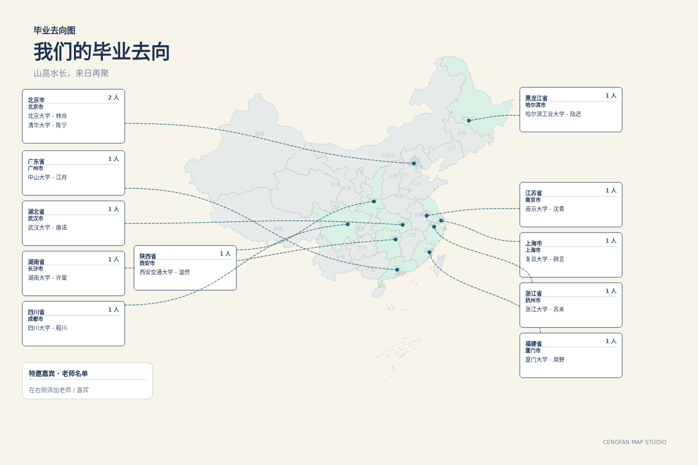
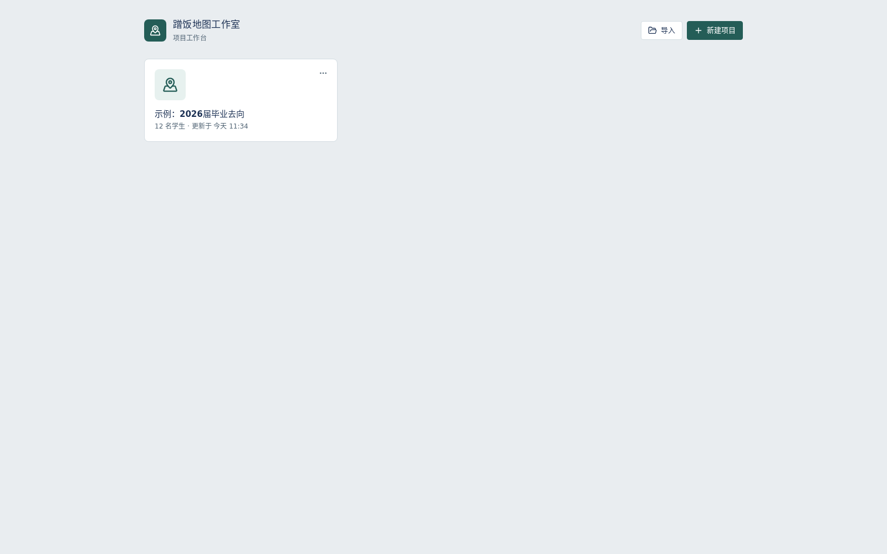
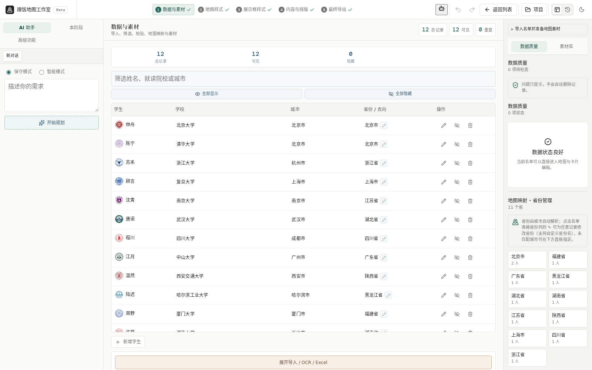
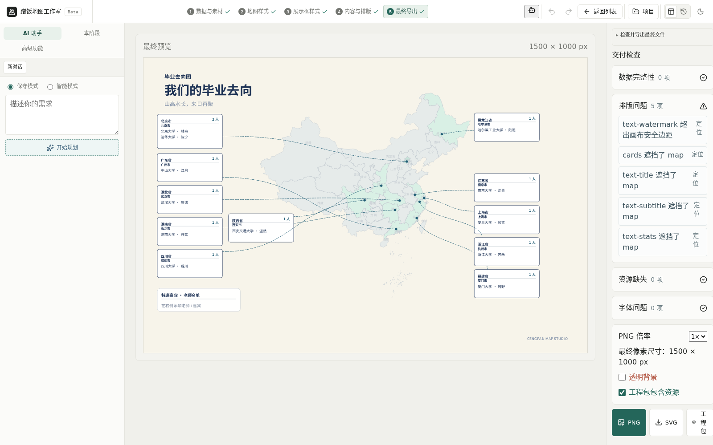

# 蹭饭图

[](LICENSE)
[](https://www.typescriptlang.org/)

**把班级名单变成可编辑、可导出的去向地图。** 名单默认留在浏览器本地，不需要公网服务器。

打开仓库即可看样例：下面这张图就是内置示例项目导出的成品（虚构姓名，已脱敏）。本机 `npm run dev` 后点开「示例：2026届毕业去向」，看到的是同一张图。

<p align="center">
  
</p>

<p align="center">
  <a href="USER_GUIDE.md">用户指南</a>
  ·
  <a href="docs/示例数据/毕业名单-脱敏.csv">脱敏名单 CSV</a>
  ·
  <a href="docs/示例数据/示例项目.cengfan">示例工程包</a>
  ·
  <a href="https://github.com/Xhhemoing/cengfan-map-studio/issues/new/choose">提意见</a>
  ·
  <a href="CONTRIBUTING.md">参与贡献</a>
</p>

---

## 样例展示

截图来自仓库内置 12 人示例，姓名为虚构。对外只讲省份/城市分布，不宣称升学率。

| 工作台（首次打开即有示例项目） | 导入名单 → 自动匹配省份 |
| --- | --- |
|  |  |

<p align="center">
  
</p>

<p align="center"><sub>从左到右：工作台 → 名单 → 画布微调 → 导出 PNG / SVG / <code>.cengfan</code> 工程包。</sub></p>

### 仓库里的示例文件

| 文件 | 用途 |
|------|------|
| 首次打开自动生成的「示例：2026届毕业去向」 | 12 人成品，点开就能改、能导出 |
| [docs/示例数据/毕业名单-脱敏.csv](docs/示例数据/毕业名单-脱敏.csv) | 更大名单（姓名已打码）。新建项目后在「数据与素材」里导入 |
| [docs/示例数据/示例项目.cengfan](docs/示例数据/示例项目.cengfan) | 完整工程包。工作台右上角「导入」即可 |
| [docs/案例模板/](docs/案例模板/) | 班额与制作流程说明（虚构分布，不是真实班级档案） |

---

## 本机 3 分钟看效果

不部署、不备案、不需要公网 IP。工程保存在当前浏览器。

```bash
git clone https://github.com/Xhhemoing/cengfan-map-studio.git
cd cengfan-map-studio
npm install
npm run dev
```

浏览器打开 http://localhost:5173

1. 工作台里点开 **示例：2026届毕业去向**
2. 走一遍「数据与素材 → 地图样式 → 展示框 → 内容与排版 → 最终导出」
3. 导出 PNG 对照上面的成品图

用自己的名单：Excel / CSV 至少三列 **姓名、去向、省份**（或城市）。新建项目 → 导入表格 → 微调重叠卡片 → 导出。逐步说明见 [USER_GUIDE.md](USER_GUIDE.md)。

---

## 功能

| 功能 | 做什么 |
|------|--------|
| Excel / CSV 导入 | 自动匹配姓名、去向、省份 |
| 智能布局 | 卡片避让，仍可拖拽微调 |
| 素材库 | 校徽、字体、贴图，可按省份绑定 |
| 卡片模板 | 多种内置样式，可改颜色与字号 |
| 高清导出 | PNG / SVG / `.cengfan` 工程包 |
| 本机协作（可选） | `npm run dev` 会带上本地 API；房间在内存里，关掉进程即消失 |

---

## 提意见

意见 48 小时内会有回复。请用模板，不要把真实姓名和去向贴进 Issue。

- 使用问题、劝退点、导入/布局/导出槽点：<https://github.com/Xhhemoing/cengfan-map-studio/issues/new/choose>
- 改代码、文档、模板：[CONTRIBUTING.md](CONTRIBUTING.md)
- 开发约定：[AGENTS.md](AGENTS.md) · [DEVELOPER.md](DEVELOPER.md)

---

## 技术栈

React 19 + Vite + TypeScript + MUI + d3-geo。内嵌 Node API 只服务本机开发（认证、协作、可选 AI）。学生名单默认在 IndexedDB，不经过远程服务器。

---

## 许可证与合规

- **[AGPL-3.0-only](LICENSE)**：自建、修改可以；把改过的版本作为网络服务提供给他人时，须向使用者提供对应源码。
- **收费**：本仓库不含支付。以后若有社区模板手续费，由班级自愿支付；不做学校统付、不做印刷生意。见 [docs/开源与收费边界.md](docs/开源与收费边界.md)。
- **隐私**：示例已脱敏。开启「智能识别名单」才会把文本发给已配置的大模型。
- **内容**：禁止真实姓名 + 具体去向同框；禁止宣称升学率、就业率、录取率。
