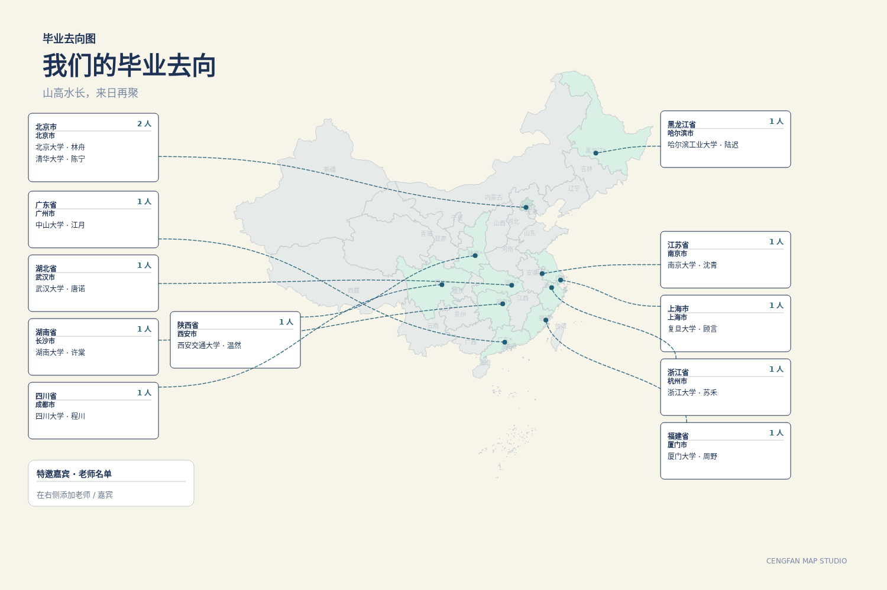
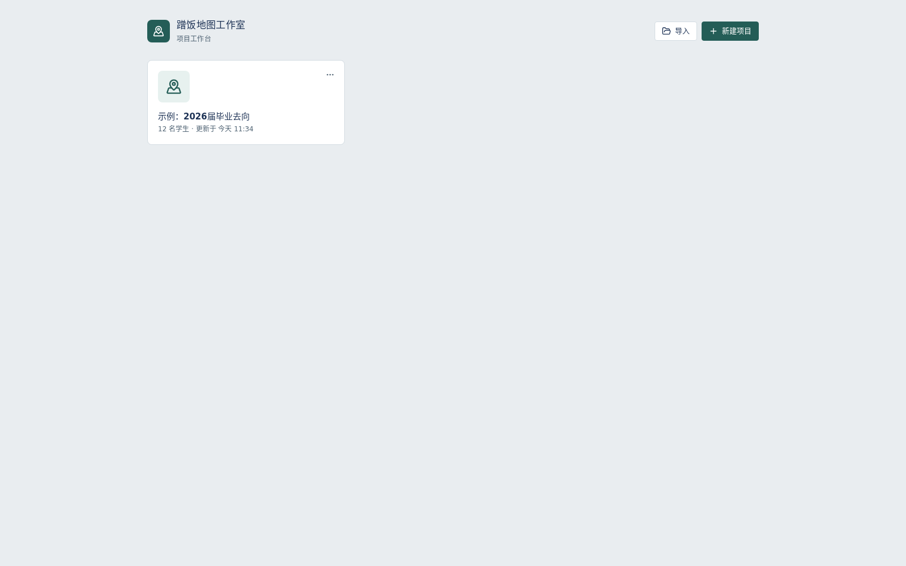
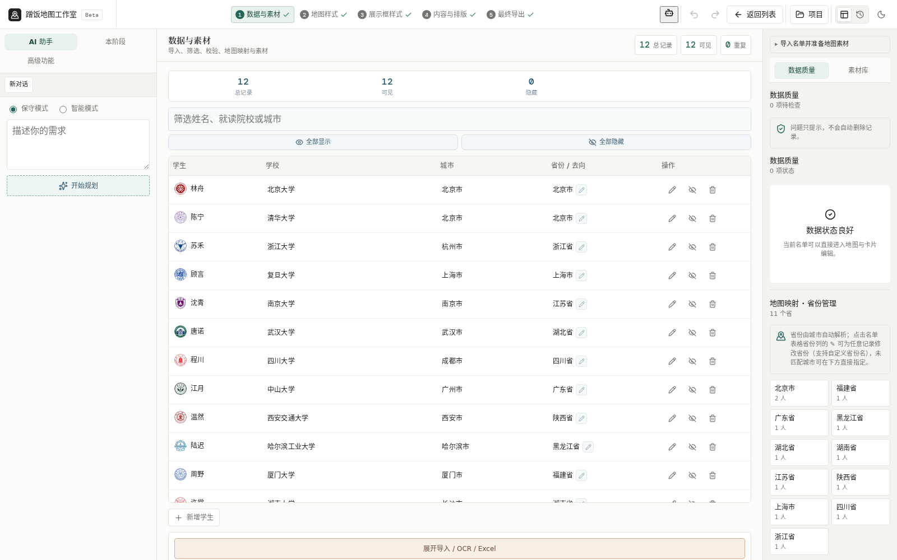

# 蹭饭图 · Cengfan Map Studio

**把毕业班名单变成可编辑、可导出的去向地图。** 一个本地优先的开源编辑器：导入表格、调整地图与卡片、导出成品，不必先注册账号或部署服务器。

[](https://github.com/Xhhemoing/cengfan-map-studio/actions/workflows/ci.yml)
[](https://github.com/Xhhemoing/cengfan-map-studio/releases/latest)
[](LICENSE)

**[在线体验](https://xhhemoing.github.io/cengfan-map-studio/) · [下载发布版](https://github.com/Xhhemoing/cengfan-map-studio/releases/latest) · [用户指南](USER_GUIDE.md) · [参与贡献](CONTRIBUTING.md) · [English introduction](#english-introduction)**

<p align="center">
  
</p>

> 项目处于 **0.1.x 早期迭代阶段**。发布版与主干预览可能不同；稳定复现请使用 Release 对应 tag。项目不是学校信息管理系统，也不提供升学率或就业率统计。

## 可以做什么

| 能力 | 当前范围 |
| --- | --- |
| 名单导入 | Excel、CSV、粘贴文本；识别姓名、院校、城市并辅助匹配省份 |
| 差异更新 | 预览新旧名单差异，人工匹配后提交；过期预览会拒绝写入 |
| 地图与排版 | 地图、卡片、连接线、模板、素材；支持手动微调与位置刷新 |
| 成品交付 | PNG、SVG，以及可继续编辑的 JSON 工程包；兼容导入历史 `.cengfan` 文件 |
| 本地项目 | IndexedDB 保存、多项目工作台、内置虚构示例 |
| 可选服务端 | 单实例 Node API 提供协作、工作区接口和可配置的 AI 能力 |

**隐私边界：** 基础导入、编辑和导出在浏览器完成。主动使用协作或远程 AI 时，相关数据会发送到配置的服务端；名单智能识别发送原文前有同意提示。工程包可能含完整姓名与去向，隐藏画布内容不等于删除源数据。请勿在公开 Issue、截图或演示中上传真实名单。

## 不安装，先体验

打开 **[在线演示](https://xhhemoing.github.io/cengfan-map-studio/)**，在工作台选择「示例：2026届毕业去向」，按「名单 → 地图 → 版式 → 内容 → 交付」完成一次导出。示例姓名为虚构。

演示站是静态构建，**不包含 Node API、在线协作和远程 AI 服务**。浏览器存储不是云备份；清理站点数据、换浏览器或换域名后，应使用事先导出的工程包恢复。

| 工作台 | 名单导入 |
| --- | --- |
|  |  |

更多文件：[脱敏 CSV](docs/示例数据/毕业名单-脱敏.csv)、[示例工程包](docs/示例数据/示例项目.cengfan)、[案例模板](docs/案例模板/)。

## 本地开发

需要 **Node.js 22.13 或更新的 22.x 版本、npm 10+、Git**。`.nvmrc`、CI 与容器以 Node 22 为基线；其他主版本暂不作为本项目的已验证环境。

```bash
git clone https://github.com/Xhhemoing/cengfan-map-studio.git
cd cengfan-map-studio
# 安装 nvm 的用户可先执行 nvm use
npm ci
npm run dev
```

打开 `http://localhost:5173`；本地 API 默认在 `http://localhost:8787`。基础编辑不需要模型密钥。只有需要远程 AI 时才复制并配置 `.env.example`；不要将密钥放入任何 `VITE_*` 变量或提交到 Git。

自己的表格建议包含 **学生姓名、录取院校、城市**，可选「去向类型」。具体表头、导入方式和导出说明见 [用户指南](USER_GUIDE.md)。

## 选择部署方式

| 方式 | 适合谁 | 说明 |
| --- | --- | --- |
| 在线演示 | 先体验、使用虚构数据 | 无需安装；静态功能 |
| Release 的 `*-web.zip` / `*-web.tar.gz` | 自行托管静态站点 | 解压到网站根路径 `/`；不包含 Node API，不要双击 HTML 以 `file://` 运行 |
| 从源码静态构建 | 需要子路径或自定义构建 | 设置 `VITE_PUBLIC_DEMO=1`，按站点配置 `BASE_PATH` |
| 单实例 Node / Docker | 需要协作或远程 AI | 需要生产密钥、持久目录、访问控制及 HTTPS 反向代理 |

静态构建（以下环境变量写法用于 POSIX shell）：

```bash
npm ci
VITE_PUBLIC_DEMO=1 BASE_PATH=/ npm run build
npx vite preview
```

`dist/` 为静态产物。GitHub 项目站应使用 `BASE_PATH=/cengfan-map-studio/` 重新构建。**`npm run preview` 是完整 Node 服务的别名，不是上述静态预览命令。**

完整服务请遵循 [自建部署](DEPLOY-SERVER.md) 与 [反向代理说明](docs/deployment/reverse-proxy.md)。不要默认开启 `AI_PUBLIC_ACCESS=1` 或 `TRUST_PROXY=1`，不要直接将应用端口暴露到公网。部署选项见 [公开演示与容器部署](docs/deployment/public-demo.md)。

## 开发与质量检查

```bash
npm run check           # 串行执行：发布工具测试、类型检查、Lint、全量测试、构建
npm run security:audit  # 另行检查依赖公告，需要联网
npx vitest run <file>   # 开发时只运行相关测试
```

重型检查不要并行启动。CI 保留测试结果；Release 另外执行生产依赖审计与 Chromium 回归。通过测试不代表没有缺陷，也不是完整的安全或无障碍认证。

```text
src/       React 编辑器、组件、导入导出与浏览器存储
server/    单实例 Node API、协作与 AI
scripts/   开发、构建、数据同步、发布与回归检查
docs/      使用、部署、计划、QA 和发布说明
public/    静态资源
```

[开发指南](DEVELOPER.md) · [文档导航](docs/README.md) · [项目现状](docs/PROJECT_STATUS.md) · [路线图](docs/ROADMAP.md) · [更新日志](CHANGELOG.md)

## 参与与支持

欢迎使用反馈、文档、测试、缺陷修复和模板贡献。小修复可直接提 PR；较大的功能先开 Issue 讨论。维护者按影响与时间安排响应，不承诺固定回复时限。

[贡献指南](CONTRIBUTING.md) · [问题与支持](SUPPORT.md) · [行为准则](CODE_OF_CONDUCT.md) · [安全报告](SECURITY.md) · [提交 Issue](https://github.com/Xhhemoing/cengfan-map-studio/issues/new/choose)

发布流程只在明确选择版本和主干 SHA 后执行，详见 [RELEASING](docs/RELEASING.md)。`package.json` 的 `private: true` 是为了防止误发 npm 包，不代表 GitHub 仓库闭源。

## 许可证与第三方资源

本项目代码沿用 **[AGPL-3.0-only](LICENSE)**，没有变更许可证。具体权利义务以许可证全文为准。第三方依赖、地图数据、校徽和字体不因放入本仓库就自动转为同一许可证，来源与待核验事项见 [第三方资源说明](THIRD_PARTY_NOTICES.md)。

本仓库不包含支付、套餐或收费后台；产品边界见 [开源与收费边界](docs/开源与收费边界.md)。

## English introduction

Cengfan Map Studio is a local-first editor for graduation destination maps. Import a spreadsheet, edit the map and cards, and export PNG, SVG, or an editable project file. The public demo is static; collaboration and remote AI require a separately configured Node service. Use Node 22.13+ within the 22.x line and npm 10+, then run `npm ci` and `npm run dev`. Code is licensed under AGPL-3.0-only; third-party assets retain their own rights. Never submit real student records in public issues.
