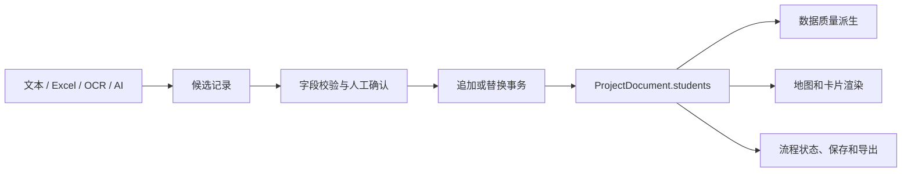

# 项目级全局数据工作台设计规格

日期：2026-08-02
状态：待用户审阅

## 1. 目标

新增项目级“全局数据工作台”，让用户在一个连续界面内完成：

- 名单导入、校验、编辑、筛选、显隐和删除；
- 未匹配城市、缺失字段和异常去向的集中处理；
- 地图图钉、省份、城市、学校、热力等数据呈现方式切换；
- 地图、卡片、文字、画布、模板和导出前效果的全局配置；
- 数据变化对地图、数据卡片、流程状态和导出的即时预览。

核心体验是“数据只维护一次，表现形式全局切换”。全局数据工作台是当前工程的数据中枢，不是跨项目统计后台，也不新增第二套名单数据模型。

## 2. 当前约束

### 2.1 单一工程状态

`ProjectDocument` 是当前工程的唯一持久化数据源，包含 `students`、`dataView`、画布、地图、卡片、辅助板块、文本、素材和历史记录。名单编辑必须继续通过现有事务入口提交，以保留撤销/重做、协作和本地同步行为。

### 2.2 现有能力复用

- `DataWorkspace` 已有文本、Excel、OCR 文本和 AI 导入能力，支持候选预览、追加/替换、行编辑、筛选和显隐。
- `GlobalSettingsScreen` 已提供全屏全局配置容器，并包含画布、地图、数据板块、辅助板块、字体排版和高级设置。
- `dataView` 已支持 `province`、`city`、`university`、`pins`、`heat`。
- `resolveStudentLocation` 和 `computeWorkflowProgress` 已能派生地理匹配与流程警告。
- 本地镜像、IndexedDB、工程包和可选工作区 API 已形成持久化链路。

### 2.3 需要解决的问题

当前 `DataWorkspace` 同时承担导入、校验、表格和批量操作，信息密度高；数据编辑入口和全局视觉设置入口也存在职责重叠。新增界面必须收敛入口，不能再复制一套名单编辑状态或视觉配置状态。

## 3. 方案决策

### 方案 A：继续扩展现有 `DataWorkspace`

改动最小，但无法自然承载数据总览、质量处理和全局视觉配置，长期会继续增大单文件职责。

### 方案 B：新增 `GlobalDataScreen`，复用现有数据工作区能力

新增一个项目级全屏工作台，由流程“准备名单”进入；现有 `DataWorkspace` 下沉为名单管理子模块。全局设置中的“数据板块”保留数据呈现配置，并提供进入全局数据工作台的入口。所有数据和视觉配置仍然写回 `ProjectDocument`。

这是本项目的采用方案，原因是它能建立清晰的产品边界，同时最大化复用已有导入、事务、渲染和持久化能力。

### 方案 C：新增跨项目分析中心

需要项目实体、用户权限、后端聚合、数据版本和独立查询模型，超出当前编辑器范围。本期不实现。

## 4. 用户入口与页面结构

### 4.1 入口

1. 顶部 `WorkflowStepper` 的“名单”步骤进入 `GlobalDataScreen` 的“数据总览”。
2. 现有全局设置的“数据板块”提供“打开全局数据”按钮，进入同一工作台的“名单管理”。
3. 数据工作台返回编辑器后，当前工程、画布、选中对象和撤销历史保持不变。

全局数据工作台是名单管理的唯一完整入口。全局设置不再复制完整名单表格；过渡期间可以保留原有入口，但必须调用同一套组件和回调。

### 4.2 顶部状态栏

左侧显示返回编辑器和当前工程名称，中间显示当前工作台页签，右侧显示：

- 总记录数；
- 可见记录数；
- 未匹配城市数；
- 海外去向数；
- 本地保存状态；
- 撤销/重做。

数据状态使用文字和数量表达，不能只依赖颜色或图标。保存失败时必须提供重试和导出工程包动作。

### 4.3 工作台页签

#### 数据总览

展示当前工程的数据健康摘要、地图覆盖率、可见/隐藏记录、海外去向、未匹配记录和当前呈现方式。每个问题摘要都能跳转到对应筛选结果。

#### 名单管理

复用现有数据表能力，支持：

- 姓名、院校、城市、去向类型、省份/匹配结果；
- 搜索和问题筛选；
- 行内编辑；
- 单条显示/隐藏、删除；
- 全部显示/隐藏；
- 追加导入和替换导入。

#### 数据质量

按问题类型分组：缺失必要字段、城市未匹配、手动省份覆盖、海外去向、隐藏记录。每个问题项提供“定位到行”“修正”“忽略/隐藏”动作。问题数量从工程数据实时派生，不单独持久化。

#### 地图映射

展示城市到省份的解析结果和未匹配项。用户可以修正省份覆盖；清空覆盖后恢复自动匹配。国际去向显示为非中国地图记录，不进入中国省份汇总。

#### 数据呈现

将同一份名单切换为：省份卡片、城市卡片、院校卡片、地图图钉和人数热力。页面同时显示当前地图、卡片和导出效果的轻量预览。

## 5. 全局视觉配置

数据工作台的“数据呈现”页与全局设置共用配置，不建立副本。

### 5.1 数据表达

- 数据视图：省份、城市、学校、图钉、热力；
- 分组方式：省份、城市、院校；
- 卡片预设：系统预设和用户保存的自定义模板；
- 可见字段：姓名、院校、城市及现有支持字段；
- 姓名展示：完整姓名、脱敏格式和现有模板格式。

### 5.2 地图样式

- 地图缩放和展示范围；
- 陆地、选中区域、边界线颜色与线型；
- 省份名称显示；
- 省份局部外观和素材；
- 海外去向卡片的显示策略。

### 5.3 海报整体样式

- 画布尺寸、背景、背景图片和透明度；
- 数据卡片布局、间距、背景和文字颜色；
- 标题、备注、嘉宾板块和字体；
- 一键智能排版和用户模板保存/应用。

所有配置变更即时反映到当前画布，并作为一笔可撤销事务提交。拖拽、滑块等连续操作继续使用现有合并历史策略，不能为每次指针移动创建历史记录。

## 6. 数据架构

### 6.1 持久化状态

继续使用：

- `ProjectDocument.students`：名单内容和显隐状态；
- `ProjectDocument.dataView`：当前数据表达方式；
- `ProjectDocument.map`、`cards`、`canvas`、`style`：全局视觉配置；
- `ProjectDocument.history`：撤销/重做；
- 现有工程包、本地工作区和可选服务端工作区。

第一阶段不改变 `Student` 的必需字段，不增加独立的“全局数据状态”。

### 6.2 界面临时状态

`GlobalDataScreen` 只维护当前页签、搜索词、筛选条件、导入文本、导入候选、候选勾选、分页和展开状态。这些状态刷新后可以丢失，不写入工程包。

### 6.3 派生数据

新增纯函数模块 `src/lib/data-health.ts`，集中提供：

- `buildDataHealthSummary(project)`；
- `listDataIssues(project)`；
- `buildStudentRowViewModel(student)`；
- `getFilteredStudents(project, filter)`。

它们复用现有地理解析、可见性和数据表达逻辑，供总览、质量页、流程徽标和导出检查共用。

## 7. 导入与提交流程

- 解析失败只影响导入会话，不改工程。
- 候选确认前不能写入 `ProjectDocument`。
- 追加/替换分别形成一笔可撤销事务。
- AI 失败时继续使用本地解析；界面必须标明实际使用的解析来源。
- 图片入口当前只支持 OCR 文本适配器，未接入真实 OCR 时不得宣称图片已完成识别。
- 导入结果需要显示成功数、拒绝数、问题数和未解析行数。

## 8. 异常与边界行为

- 空工程：显示导入和新增记录主操作，不渲染虚假数据行。
- 未匹配城市：保留原始城市，提供省份覆盖修正，不静默改写用户输入。
- 隐藏记录：仍保留在工程中，在总览和质量页可追踪，但不进入可见海报。
- 保存失败：保留内存工程，显示重试、本地工程包导出和失败原因。
- 工程恢复：恢复后重新派生问题摘要和地图预览，不恢复界面筛选状态。
- 大名单：表格筛选和派生摘要使用 `useMemo`；不在本期引入虚拟列表，先以现有项目规模和可测试性为准。

## 9. 组件边界

- `src/components/GlobalDataScreen.tsx`：全屏工作台壳层、页签、状态栏和入口回调。
- `src/components/DataOverview.tsx`：数据摘要和问题跳转。
- `src/components/DataQualityPanel.tsx`：问题分组和快速修正。
- `src/components/DataWorkspace.tsx`：名单表格和导入会话，逐步拆分内部导入区与表格区。
- `src/components/DataPresentationPanel.tsx`：数据视图、模板、卡片和地图的全局配置入口。
- `src/lib/data-health.ts`：纯派生逻辑和问题类型。
- `src/App.tsx`：只负责工程事务、页面入口和状态接线，不承载新的数据判断逻辑。
- `src/components/GlobalSettingsScreen.tsx`：保留全局视觉设置容器，数据板块提供统一跳转，不复制名单行为。

## 10. 无障碍与响应式

- 工作台页签使用 `tablist`、`tab`、`tabpanel` 语义和 roving tabindex。
- 所有图标按钮保留明确的 `aria-label` 和 tooltip。
- 表格编辑控件必须有字段级标签，问题行能通过键盘定位和修正。
- 1440px 使用左侧导航、主工作区和右侧状态/预览区域；768px 收窄为导航加主工作区；390px 使用顶部横向页签和单列内容。
- 320px、390px、768px、1024px、1440px 均不得产生页面级横向滚动。
- 数据状态不能仅使用红/绿颜色表达，必须同时包含文字或数量。

## 11. 测试与验收

### 单元测试

- 数据健康摘要正确统计总数、隐藏、海外、未匹配和缺失字段。
- 省份覆盖、自动匹配和国际去向的派生结果正确。
- 筛选条件不会修改工程数据。
- 导入候选在确认前不产生工程变更；追加/替换结果可撤销。

### 组件测试

- 总览指标与问题跳转正确。
- 名单编辑、显隐、删除和批量操作仍复用现有回调。
- 数据视图、模板和全局配置会调用统一事务入口。
- AI 失败时显示本地解析结果或明确错误，不产生半提交状态。

### 集成测试

- “准备名单”进入全局数据工作台，“打开全局数据”进入同一界面。
- 名单修改后地图、卡片、流程徽标和导出检查同步更新。
- 撤销/重做、刷新恢复、工程包导入导出保持一致。
- 本地保存失败时页面仍可继续编辑，并提供恢复动作。

### 浏览器验收

- 1440、1024、768、390、320 五个视口无页面级横向溢出。
- 从导入到确认、从问题定位到修正、从数据视图切换到画布预览均无控制台错误。
- 深浅色主题下控件、表格、警告和焦点状态可读。
- 编辑器、全局数据工作台和导出结果使用同一份工程配置。

## 12. 实施顺序

1. 新增 `data-health.ts` 及纯函数测试。
2. 拆分 `DataWorkspace` 的导入会话、表格和摘要区域，保持现有回调契约。
3. 新增 `GlobalDataScreen` 壳层和数据总览页。
4. 增加数据质量与地图映射页。
5. 将数据呈现与模板配置接入全局工作台，并收敛全局设置入口。
6. 接入流程导航、持久化状态提示和完整集成测试。
7. 完成 TypeScript、Vitest、lint、build 和多视口浏览器验收。

## 13. 明确不做

- 不新增跨项目统计后台。
- 不新增独立名单数据库或第二套工程状态。
- 不把 AI 作为确定性排版和数据校验的唯一入口。
- 不在本期引入真实 OCR 服务、用户权限系统或协作数据权限模型。
- 不重写现有地图投影、卡片排版、工程包格式和导出路径。
